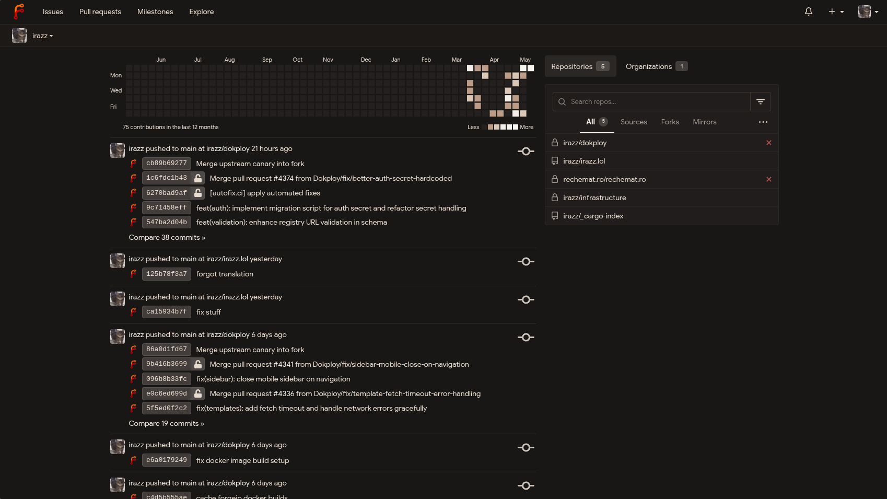
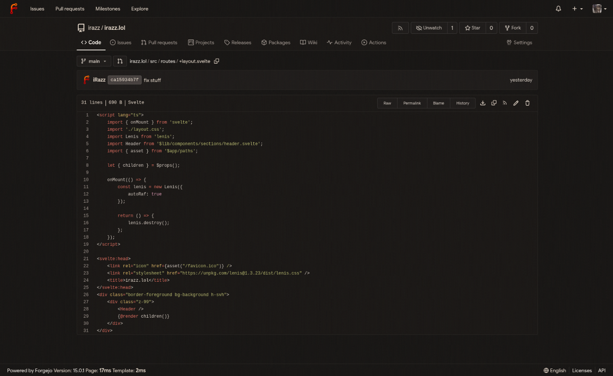
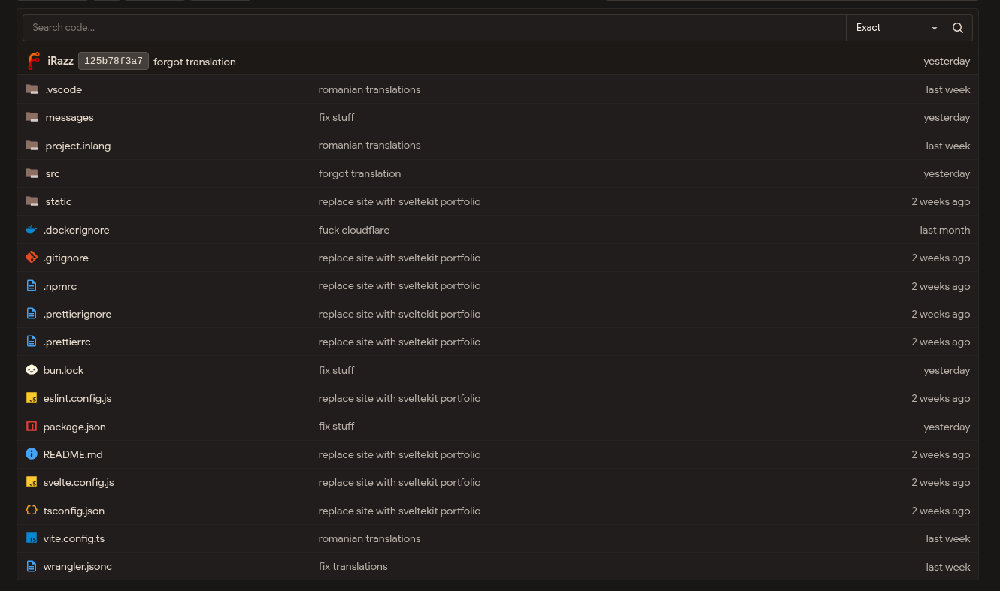

# Theming Forgejo

Make your Forgejo instance look better with small CSS modules.

> **Warning**: this CSS is AI-generated.

## Modules

The modules live in [`modules/`](https://github.com/irazvan2745/forgejo-theming/tree/main/modules).

### `mocha-theme.css`

Main Forgejo theme colors.



```css
@import url("https://jsr.io/@irazvan2745/forgejo-theming/modules/mocha-theme.css");
```

### `syntax-highlighting.css`

Chroma code highlighting colors.



```css
@import url("https://jsr.io/@irazvan2745/forgejo-theming/modules/syntax-highlighting.css");
```

### `material-icon.css`

Material-style repository file icons.



```css
@import url("https://jsr.io/@irazvan2745/forgejo-theming/modules/material-icon.css");
```

## Install Modules

Create the CSS file that Forgejo will load:

```sh
sudo mkdir -p /opt/forgejo/css
sudo nano /opt/forgejo/css/theme-rizz.css
```

Add the modules you want

```css
@import url("https://jsr.io/@irazvan2745/forgejo-theming/modules/mocha-theme.css");
@import url("https://jsr.io/@irazvan2745/forgejo-theming/modules/syntax-highlighting.css");
@import url("https://jsr.io/@irazvan2745/forgejo-theming/modules/material-icon.css");
```

## Docker Setup

Mount the CSS file into Forgejo:

```yaml
services:
  forgejo:
    volumes:
      - /opt/forgejo/css/theme-rizz.css:/data/gitea/public/assets/css/theme-rizz.css:ro
```

Add the theme to your Forgejo environment:

```sh
FORGEJO__ui__THEMES=gitea,arc-green,forgejo-dark,forgejo-light,forgejo-auto,rizz
FORGEJO__ui__DEFAULT_THEME=rizz
```

Restart Forgejo, then select the `rizz` theme in your user settings.
